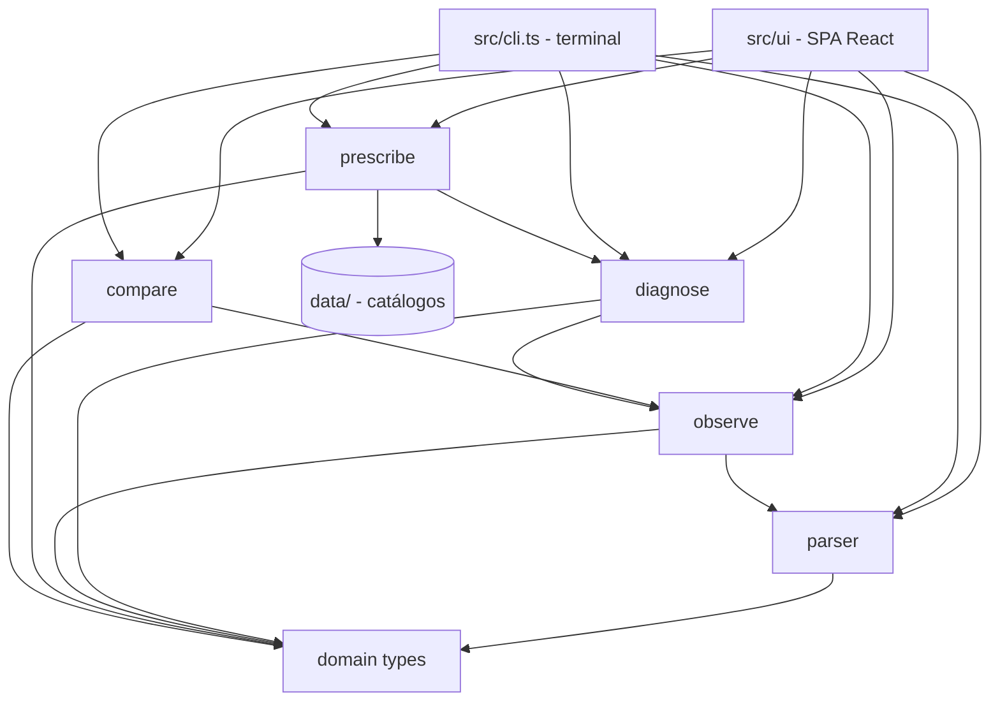
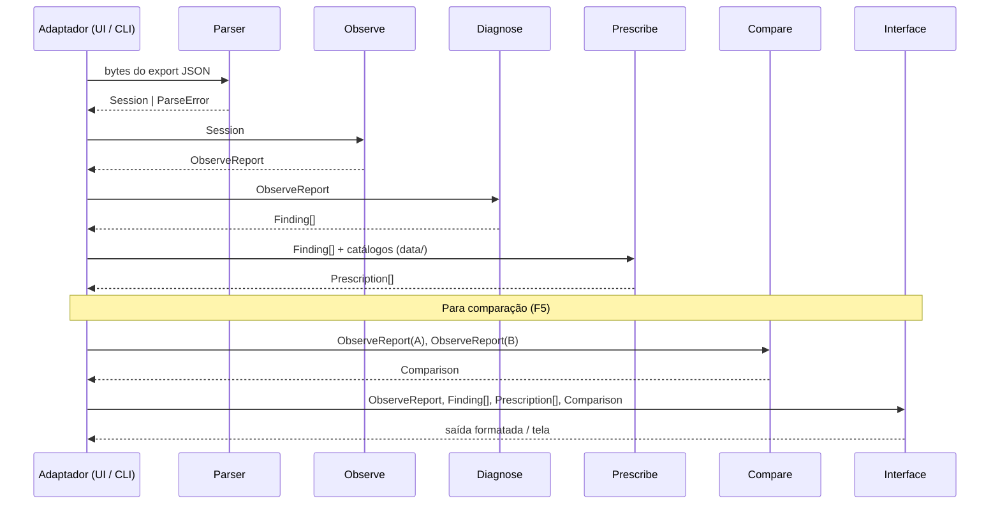

# Arquitetura — Hindsight

Documento de referência para implementação. Define componentes, fronteiras,
fluxo de dados, dependências permitidas, política de erros e rastreabilidade.
Uma pessoa nova deve conseguir identificar onde implementar cada fase do
roadmap sem reler este documento mais de uma vez.

---

## Visão geral

Hindsight é uma **aplicação web estática de análise de sessões do IBM Bob**. Ela
recebe um ou mais exports JSON de sessão, detecta padrões de desperdício, gera
configuração corrigida — `AGENTS.md`, ferramentas a desligar, Skills, MCPs,
subagentes — e compara duas rodadas do mesmo experimento.

O produto é uma SPA que roda **inteiramente no navegador**. A CLI continua
existindo como ferramenta de desenvolvimento sobre o mesmo core.

**Não há backend, não há banco de dados e não há chamada de rede no caminho
crítico — e isso é restrição dura, não preferência.** Um export de sessão contém
código-fonte, caminhos absolutos da máquina do usuário e os comandos que ele
executou. Enviar isso para um servidor tornaria a ferramenta inutilizável em
qualquer empresa. O dado não sai do navegador.

```text
export JSON (entrada não-confiável)
    │
    ▼
┌─────────────────────────────────────────────────────────┐
│  Parser          valida e normaliza o export bruto       │
│  (src/parser/)                                           │
└────────────────────────┬────────────────────────────────┘
                         │ Session (tipo normalizado)
                         ▼
┌─────────────────────────────────────────────────────────┐
│  Domínio / Observe   extrai métricas estáveis            │
│  (src/observe/)                                          │
└────────────────────────┬────────────────────────────────┘
                         │ ObserveReport
                         ▼
┌─────────────────────────────────────────────────────────┐
│  Detectores / Diagnose   identifica achados              │
│  (src/diagnose/)                                         │
└────────────────────────┬────────────────────────────────┘
                         │ Finding[]
                         ▼
┌─────────────────────────────────────────────────────────┐
│  Prescribe   gera artefatos de configuração              │
│  (src/prescribe/)                                        │
└────────────────────────┬────────────────────────────────┘
                         │ Prescription[]
                         ▼
┌─────────────────────────────────────────────────────────┐
│  Compare / Verify   delta entre rodadas                  │
│  (src/compare/)                                          │
└────────────────────────┬────────────────────────────────┘
                         │ Comparison
                         ▼
┌─────────────────────────────────────────────────────────┐
│  Adaptadores   apresentam resultados                     │
│                                                          │
│    src/ui/      SPA React — o produto                    │
│    src/cli.ts   terminal — ferramenta de desenvolvimento │
└─────────────────────────────────────────────────────────┘

O core (parser → compare) é idêntico nos dois adaptadores: são funções puras,
sem I/O e sem dependência de Node, portanto executam no navegador sem alteração.
Os catálogos de `data/` entram em `prescribe` como dado estático.
```

---

## Componentes e responsabilidades

### `src/parser/`

**Responsabilidade:** receber bytes do export e devolver um `Session` válido ou
um `ParseError` descritivo.

- Lê `version`, `exportedAt`, `workspace` e `tasks[]`.
- Ignora chaves de raiz prefixadas por `_` (e.g., `_metadata`).
- Valida tipos obrigatórios com a biblioteca de validação do projeto.
- Rejeita o arquivo com erro compreensível se a estrutura for inválida.
- Trata o JSON como entrada não-confiável: não executa, não avalia.
- Não aplica lógica de negócio. Não calcula percentuais. Não classifica achados.

**Não importa nada de:** `observe`, `diagnose`, `prescribe`, `compare`, UI.

### `src/observe/`

**Responsabilidade:** transformar um `Session` em métricas estáveis e
tipadas que os detectores possam consumir.

- Ordena mensagens por `data._meta.timestamp` (não por `createdAt`).
- Extrai `TurnMetrics` de cada mensagem `assistant` com `_meta.spend`.
- Extrai `ToolCallRecord[]` achatados preservando o turno de origem e a
  correlação chamada ↔ resultado pelo `id`.
- Extrai `ContextBreakdown` calculando percentuais sobre `breakdown.total`.
- Calcula `conversationTokens = reportedTotal − total`.
- Conta turnos, tool calls, erros e intervenções humanas (`role: user` após
  a primeira mensagem).
- Produz `ObserveReport` — representação completa do que aconteceu na sessão,
  sem diagnóstico embutido.

**Não importa nada de:** `diagnose`, `prescribe`, `compare`, UI.

### `src/diagnose/`

**Responsabilidade:** converter sinais do `ObserveReport` em `Finding[]`
explicáveis, sem falsos positivos no baseline real.

- Cada detector é uma função pura. Detectores baseados somente no report usam
  `(ObserveReport) => Finding[]`; os que dependem de catálogo retornam
  `DiagnoseResult`, preservando o motivo quando o dado externo está indisponível.
- Detectores P0 do roadmap:
  - `#13` — `projectRules === 0`
  - `#14` — ferramenta disponível e nunca chamada
  - `#12` — intervenção humana
- Detectores P1:
  - `#10` — releitura redundante (mesmo `path` em turnos distintos)
  - `#11` — retry após falha (`isError: true` seguido da mesma ferramenta)
- Cada `Finding` carrega a evidência redigível que o originou (ver
  [Rastreabilidade](#rastreabilidade)).

**Não importa nada de:** `prescribe`, `compare`, UI.

### `src/prescribe/`

**Responsabilidade:** transformar `Finding[]` em `Prescription[]` e gerar
artefatos de configuração revisáveis.

- Cada prescrição aponta para o(s) achado(s) que a motivaram.
- Todo gerador é **determinístico**: mesma entrada, mesmo arquivo.
- Não copia conteúdo privado de mensagens para o artefato gerado.
- Não inclui transcript bruto, segredos nem a solução completa do benchmark.
- Apresenta diff antes de gravar qualquer arquivo.

#### As cinco famílias de prescrição

| Família | `PrescriptionKind` | Sinal de origem | Confiança |
|---|---|---|---|
| Conhecimento do projeto | `agents-md-file`, `agents-md-section` | `projectRules === 0`, intervenções humanas, releituras, retries | alta |
| Desligar ferramenta | `disable-tool`, `custom-mode` | `ToolInventory.idle` | alta |
| Desligar Skill | `disable-skill` | `skills > 0` com `loadedSkills: []` | alta |
| Habilitar MCP | `enable-mcp` | `ExternalCommandRecord.binaries` × `McpCatalogEntry` | média |
| Criar Skill / dividir em subagente | `create-skill`, `split-subagent` | repetição entre N sessões / `ContextSummary.pressure` | baixa ou indisponível |

Duas regras que evitam recomendação sem lastro:

- **`create-skill` exige mais de uma sessão.** Uma Skill se justifica por
  procedimento **recorrente**; com um único export não há repetição observável.
  Com uma sessão, o gerador emite confiança `"low"` ou não emite.
- **`split-subagent` exige `maxContextWindow`.** Esse valor não vem no export
  (ver [Parâmetros externos](#parâmetros-externos-ao-export)). Com
  `pressure === null`, a prescrição não é emitida. **Ausência de dado não vira
  recomendação.**

O mapeamento completo achado → prescrição está em
[`domain-model.md`](./domain-model.md), Modelo 8.

**Importa de:** `src/domain/`, `src/diagnose/`, e os catálogos de `data/`.

**Não importa nada de:** `compare`, UI.

### `src/compare/`

**Responsabilidade:** receber dois `ObserveReport` (Rodada A e Rodada B) e
produzir um `Comparison` com deltas absolutos e percentuais.

- Registra também regressões e métricas sem mudança.
- Não escolhe qual métrica destacar — isso é responsabilidade da interface.

**Não importa nada de:** `diagnose`, `prescribe`, UI.

### `src/ui/` — a aplicação (produto)

**Responsabilidade:** orquestrar os módulos acima e apresentar resultados.

- Único lugar, junto com `src/cli.ts`, autorizado a chamar os outros módulos em
  sequência.
- Único lugar autorizado a **arredondar** número (I-3) e a **redigir** dado
  sensível antes de exibir.
- **A interface só exibe; nunca infere.** Nenhum cálculo de negócio, nenhuma
  classificação, nenhuma heurística vive aqui.
- Estados de carregamento, erro, export inválido e ausência de Rodada B são
  apresentados com mensagem compreensível.

#### Referência visual da F6

`prototipo/Hindsight.html` é a fonte de verdade visual para as telas da F6:
estrutura em cinco etapas, paleta, tipografia, espaçamento, estados e padrões de
interação devem partir dele. Os números e textos simulados do protótipo não são
fonte de domínio — a implementação sempre renderiza os contratos reais do core.

#### Entrada

Arquivos entram por drag-and-drop ou seletor, lidos com `FileReader` — **nunca
por upload**. A tela aceita **N arquivos**: um basta para o diagnóstico, dois
habilitam a comparação A/B, e três ou mais são o que torna `create-skill`
defensável.

O botão **"Ver exemplo"** carrega `fixtures/sample-export.json` embutido no
bundle. É o modo demo: funciona em máquina limpa, sem arquivo, sem credencial e
sem rede.

#### As quatro telas

| # | Tela | Conteúdo | Fase |
|---|---|---|---|
| 1 | Diagnóstico | Barra empilhada do `ContextBreakdown`, com `projectRules` destacado quando zero. Overhead fixo, conversa e total, separados | F6 · #21 |
| 2 | Achados | Lista de `Finding[]`, cada um com turno, `fieldPath` e o trecho que o comprova | F6 · #22 |
| 3 | Prescrições | Abas por família: `AGENTS.md` (com diff), Ferramentas, Skills, MCPs, Subagentes. Cada item com evidência, justificativa e botão copiar/baixar | F6 · #21–#22 |
| 4 | Verificação | Tabela de delta A vs B, a partir de dois `ObserveReport` | F6 · #23 |

#### Restrições de browser

- **Sem API de Node** em nada que a UI importe — o core não usa `fs`, `path`
  nem `process`, e essa proibição passa a valer para toda a árvore fora de
  `src/cli.ts`.
- Conteúdo vindo do export **nunca** é injetado como HTML. Sem
  `dangerouslySetInnerHTML`, sem `innerHTML`, sem `eval`. O export é entrada
  não-confiável também no navegador.
- Nenhum `fetch`, `XMLHttpRequest`, WebSocket ou telemetria. O bundle é
  autocontido.
- Nenhum dado é persistido fora da aba — sem envio, sem sincronização.

### `src/cli.ts` — a ferramenta de desenvolvimento

Mesmo core, saída em terminal. Existe para rodar o pipeline em CI, inspecionar um
export rapidamente e validar os portões das fases sem abrir o navegador. **Não é
o produto entregue**, e nenhuma funcionalidade pode existir só nela.

---

## Catálogos de recomendação (`data/`)

Duas prescrições dependem de conhecimento que o export **não carrega**: o export
registra que o agente rodou `docker build`, mas não sabe que existe um servidor
MCP de Docker.

Esse conhecimento vive em catálogos JSON versionados, carregados como dado
estático:

| Arquivo | Conteúdo | Alimenta |
|---|---|---|
| `data/mcp-catalog.json` | `McpCatalogEntry[]` — binário → servidor MCP, o que substitui, por quê | `mcp-candidate` → `enable-mcp` |
| `data/tool-catalog.json` | `ToolCatalogEntry[]` — ferramenta → propósito → grupo | agrupa `unused-tool` na interface |

Regras:

- **São dado, não código.** Acrescentar um servidor MCP ao catálogo não exige
  alterar detector nem gerador.
- **Entrada confiável**, ao contrário do export: são versionados no repositório e
  revisados em PR.
- **Degradam, não quebram.** Catálogo ausente ou inválido faz o detector
  correspondente não emitir achado, e o relatório registra o motivo.
- Ferramenta ausente do `tool-catalog` aparece no grupo `"outros"` — **nunca
  omitida**, porque omitir uma ferramenta ociosa esconde exatamente o desperdício
  que queremos mostrar.
- Nenhuma entrada contém segredo, URL interna ou caminho de máquina.

Os tipos estão em [`domain-model.md`](./domain-model.md), Modelo 10.

---

## Nenhuma chamada a LLM

**Nenhum módulo do Hindsight chama modelo de linguagem, e nenhum faz requisição
de rede.** Isso vale inclusive para gerar `AGENTS.md`, redigir texto de
recomendação ou classificar achado.

Não é purismo. Chamar um modelo quebraria quatro coisas ao mesmo tempo:

| O que quebra | Por quê |
|---|---|
| Modo demo sem API key | Passaria a exigir credencial — e o jurado avalia numa máquina limpa |
| Deploy estático | Exigiria backend para guardar a chave, ou exporia a chave no bundle |
| Privacidade | O export sairia da máquina do usuário |
| Explicabilidade | "Por que essa recomendação?" deixaria de ter resposta verificável |

A recomendação é **regra + catálogo**: determinística, auditável, e sempre
rastreável até um campo do export. É mais trabalhoso de escrever e
incomparavelmente mais defensável.

---

## Parâmetros externos ao export

Nem tudo que o produto precisa está no arquivo. O que falta é **parâmetro
explícito com padrão honesto**, nunca constante escondida:

| Parâmetro | Padrão | Consequência |
|---|---|---|
| `maxContextWindow` | `null` | Sem ele, `ContextSummary.pressure` é `null` e o detector de subagente não avalia. A UI do Bob exibe `270.0k`, mas esse número **não está no export** — só pode ser informado pelo usuário |
| Tokens de entrada/saída e cache | indisponível | Não existem em `_meta.spend`. Aparecem em `unavailableMetrics`, nunca como `0` |
| `buildFailures` | ausente | Contagem manual do `METRICS.md`. Preenchimento automático só via proxy declarado |
| SHA do commit | ausente | `gitSha` vem `null`; registrado à mão junto do screenshot |

A regra é uma só: **ausência de dado é ausência, não zero.** Um relatório que
mostra `0` onde não mediu nada é pior que um relatório que mostra "indisponível".

---

## Diagrama de dependências permitidas

Regra: **dependências só apontam para baixo** (em direção ao domínio). Nenhum
módulo de infraestrutura/UI importa domínio para tomar decisões de negócio.



`src/ui/` e `src/cli.ts` são **adaptadores irmãos** sobre o mesmo core. Nenhum
importa o outro, e nenhuma funcionalidade pode existir só em um deles.

**Regra explícita de proibição:**
- `parser` não importa `observe`, `diagnose`, `prescribe`, `compare` nem UI.
- `observe` não importa `diagnose`, `prescribe`, `compare` nem UI.
- `diagnose` não importa `prescribe`, `compare` nem UI.
- `prescribe` não importa `compare` nem UI. Importa `data/` (catálogos).
- Nenhum módulo de domínio importa biblioteca de UI ou de CLI.
- Nenhum módulo fora de `src/cli.ts` importa API de Node (`fs`, `path`,
  `process`) — o core precisa continuar executável no navegador.
- Nenhum módulo, em nenhuma camada, importa cliente HTTP ou SDK de LLM.
- `src/ui/` e `src/cli.ts` não importam um ao outro.

---

## Fluxo de dados detalhado



Cada etapa é invocável de forma independente. O CLI pode parar em qualquer
fase e emitir o resultado parcial.

---

## Fronteiras entre sinal, achado e prescrição

| Conceito | Tipo | Origem | O que contém |
|---|---|---|---|
| **Sinal** | campo do export | `parser` / `observe` | Dado bruto normalizado — sem interpretação |
| **Achado** (`Finding`) | tipo de domínio | `diagnose` | Interpretação de um sinal: severidade, confiança, evidência, rastreabilidade |
| **Prescrição** (`Prescription`) | tipo de domínio | `prescribe` | Ação corretiva derivada de um ou mais achados |

Um sinal nunca é elevado a achado sem passar por um detector explícito. Um
achado nunca é elevado a prescrição sem uma regra de mapeamento explícita em
`prescribe`. A interface só exibe; nunca infere.

### Contrato mínimo de um `Finding`

```
Finding {
  code:        string        // estável entre versões, e.g. "PROJ_RULES_ZERO"
  title:       string        // frase curta para exibição
  severity:    "high" | "medium" | "low"
  confidence:  "confirmed" | "likely" | "possible"
  taskId:      string        // task de origem
  turnIndices: number[]      // turnos envolvidos (0-based sobre assistants)
  evidence:    Evidence      // veja Rastreabilidade abaixo
  metric:      object        // o número observado
  explanation: string        // por que isso é um problema
  prescriptionHint: string   // tipo de prescrição possível
}
```

---

## Rastreabilidade

Todo achado deve ser rastreável até a origem exata no export. O campo
`evidence` do `Finding` carrega:

| Campo | O que identifica |
|---|---|
| `taskId` | Task de origem (`tasks[].task.id`) |
| `messageId` | Mensagem de origem (`messages[].id`) |
| `turnIndex` | Índice do turno do assistente (0-based) |
| `toolCallId` | `toolCalls[].id` ou `toolUsage.signature.id`, quando aplicável |
| `fieldPath` | Caminho JSON de origem, e.g. `"tasks[0].task.costs.contextWindowBreakdown.breakdown.projectRules"` |
| `redactable` | `true` se o campo contém conteúdo de mensagem ou argumento de ferramenta |

Achados cujo `redactable` é `true` devem ter o conteúdo substituído por
`[REDACTED]` quando a interface estiver no modo de redação.

---

## Política de erros e validação

### Entrada

- O export JSON é tratado como entrada não-confiável.
- Erros de parse produzem `ParseError { message, path?, received? }` — nunca
  exceção não-tratada que vaze stack trace para o usuário.
- Campos ausentes ou nulos em posições opcionais são tratados como
  indisponíveis (`null` / `undefined`), não como erro.
- O relatório marca métricas indisponíveis explicitamente em vez de inventar
  valores (e.g., tokens de entrada/saída não estão no export; o campo fica
  `null`, não `0`).

### Cálculos

- Valores monetários (`cost`) são preservados como `number` sem arredondamento
  durante os cálculos. Apresentação pode arredondar; domínio não.
- Timestamps são sempre epoch em milissegundos. Nenhum módulo de domínio
  converte para string ou Date antes do momento de apresentação.
- Percentuais do breakdown são calculados sobre `breakdown.total` (overhead
  fixo), não sobre `reportedTotal` (contexto total).

### Classificação de severidade dos erros ao usuário

| Situação | Comportamento |
|---|---|
| JSON inválido ou `version` ausente | Aborta com `ParseError` descritivo |
| Campo opcional ausente | Continua; marca como indisponível |
| Task sem mensagens | Inclui na sessão com aviso, não aborta |
| Detector lança exceção | Isola o detector; reporta como falha de detector, não como crash |
| Arquivo de saída já existe | Exibe diff; aguarda confirmação antes de sobrescrever |

---

## Dados sensíveis e redação

- Argumentos de ferramentas de arquivo (`path`, `content`) e conteúdo de
  mensagens do usuário são considerados potencialmente sensíveis.
- Nenhum módulo de domínio (parser, observe, diagnose) redige ou filtra dados
  — eles trabalham com os dados completos internamente.
- A redação acontece **somente na camada de saída** (interface / CLI).
- A flag `evidence.redactable` sinaliza quais campos de evidência devem ser
  reduzidos na exibição padrão.
- Fixtures sintéticas não devem conter caminhos reais, nomes de usuário nem
  conteúdo de repositório privado.
- O artefato gerado pela `prescribe` (e.g., `AGENTS.md`) não copia mensagens
  brutas, segredos nem a solução completa do benchmark.

---

## Modelo de tipos de domínio (resumo)

Tipos completos em `docs/domain-model.md`. Resumo das fronteiras:

```
Session            ← saída do parser; entrada de observe
ObserveReport      ← saída de observe; entrada de diagnose, compare e interface
Finding[]          ← saída de diagnose; entrada de prescribe
Prescription[]     ← saída de prescribe; entrada da interface
Comparison         ← saída de compare; entrada da interface
McpCatalogEntry[]  ← dado de data/; entrada de prescribe
ToolCatalogEntry[] ← dado de data/; entrada de prescribe
```

`ObserveReport` é o contrato central: **depois da F2, nenhum módulo lê o export
cru.** É também o tipo que a interface inteira consome.

Tipos que cruzam fronteiras são imutáveis após sua criação. Nenhum módulo
downstream altera o objeto recebido.

---

## Onde implementar cada fase do roadmap

| Fase | Diretório principal | Tipos consumidos | Tipos produzidos |
|---|---|---|---|
| **F2 — Observe** (`#5`–`#9`) | `src/parser/`, `src/observe/` | bytes → `Session` → `ObserveReport` | `ObserveReport` |
| **F3 — Diagnose** (`#10`–`#14`) | `src/diagnose/` | `ObserveReport` | `Finding[]` |
| **F4 — Prescribe** (`#16`–`#18`) | `src/prescribe/` | `Finding[]` | `Prescription[]`, `AGENTS.md` |
| **F5 — Verify** (`#19`–`#20`) | `src/compare/` | `ObserveReport` × 2 | `Comparison` |
| **F6 — Interface** (`#21`–`#24`) | `src/ui/` (produto), `src/cli.ts` (dev) | todos os anteriores | as quatro telas / saída formatada |

Cada módulo tem seus próprios testes unitários em `src/<modulo>/__tests__/` ou
`src/<modulo>/` com sufixo `.test.*`. Fixtures em `fixtures/` são
compartilhadas entre todos os módulos.

---

## Distribuição e deploy

O build produz **arquivos estáticos**. Não há runtime de servidor, variável de
ambiente nem segredo em nenhum ambiente.

| Alvo | Saída | Como roda |
|---|---|---|
| Web (produto) | `dist/web/` — HTML + JS + CSS | Hospedagem estática (GitHub Pages, Vercel, Netlify) ou aberto localmente |
| CLI (desenvolvimento) | `dist/cli.js` | `node dist/cli.js` |

Isso atende às duas exigências de submissão de uma vez: **existe URL pública e
funciona local**, com o mesmo artefato.

### Privacidade como propriedade de arquitetura

O arquivo é lido com `FileReader` e processado na aba. **Nada é enviado.** Não é
uma limitação contornada — é a razão pela qual a ferramenta é utilizável num
repositório privado de empresa, e deve ser dita explicitamente na interface e no
material de submissão.

### Consequências práticas

- Nenhum estado compartilhado entre usuários: dois exports abertos por pessoas
  diferentes nunca se encontram.
- Recarregar a página perde o estado. É aceitável e preferível a persistir dado
  de sessão alheia.
- O bundle precisa incluir `fixtures/sample-export.json` e os catálogos de
  `data/`, senão o modo demo não funciona offline.
- O tamanho do bundle importa: o fixture do baseline tem ~74 KB.

---

## Fixtures e modo demo

- `fixtures/sample-export.json` é cópia fiel do `benchmark/rodada-a.json` e
  serve como input padrão para testes e demo.
- Fixtures sintéticas cobrem casos que não aparecem no baseline real (export
  inválido, task sem mensagens, ferramenta com erro, resultado órfão, etc.).
- O modo demo carrega fixtures embutidas e não requer arquivo externo,
  credencial ou sessão ativa.

Fixtures sintéticas necessárias, porque o baseline real **não** exercita esses
caminhos (ver [`analise-rodada-a.md`](./analise-rodada-a.md)):

| Fixture | Existe para |
|---|---|
| sessão com `isError: true` seguido de retry | detector `retry-after-error` (#11) |
| sessão com releitura do mesmo `path` | detector `redundant-read` (#10) |
| sessão com mensagem `user` no meio | detector `human-intervention` (#12) |
| sessão com contexto alto e `maxContextWindow` informado | detector `subagent-candidate` |
| N sessões com o mesmo procedimento repetido | detector `skill-candidate` |
| export inválido, task sem mensagens, chamada órfã, resultado órfão | política de erros |

---

## Armadilhas confirmadas do schema

Estas armadilhas devem ser tratadas explicitamente no parser e nos testes:

- `messages[].createdAt` é o mesmo em todas as mensagens — inútil para
  ordenação. Usar `data._meta.timestamp`.
- `_meta.spend` só existe em mensagens `assistant`. Acessar sem guarda quebra.
- Um turno `assistant` pode conter múltiplos `toolCalls` em paralelo.
  Correlacionar pelo `id`, nunca pela ordem.
- `tasks[].task.status` fica `"active"` mesmo em task concluída. Usar
  `stop: true` na última mensagem `assistant`.
- `breakdown.total` ≠ `breakdown.reportedTotal`. A diferença é esperada.
- `tasks[].task.parentId` não-nulo indica subtask — não somar suas métricas
  duas vezes ao agregar a sessão.
- `gitSha` e `gitBranch` vêm `null`. O commit de partida é registrado
  manualmente.
