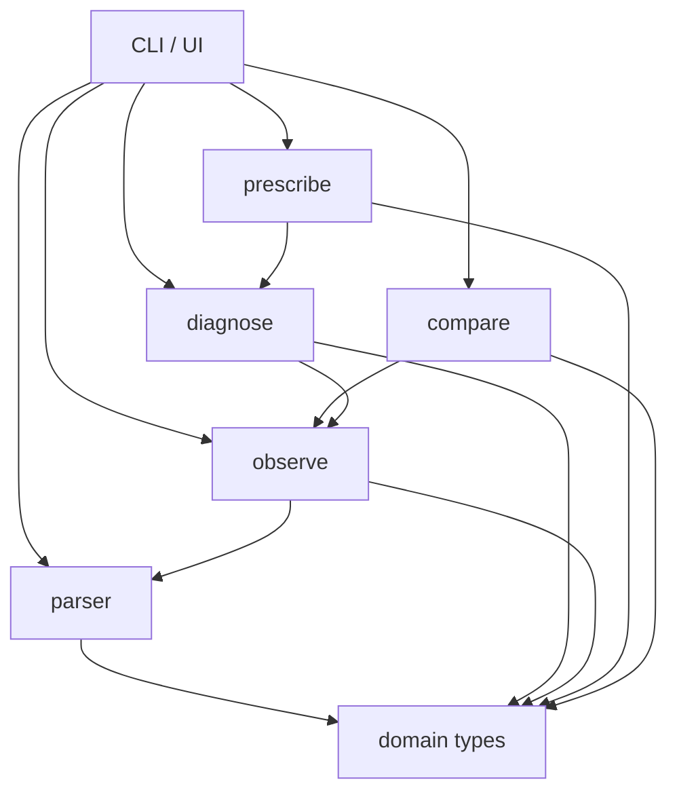
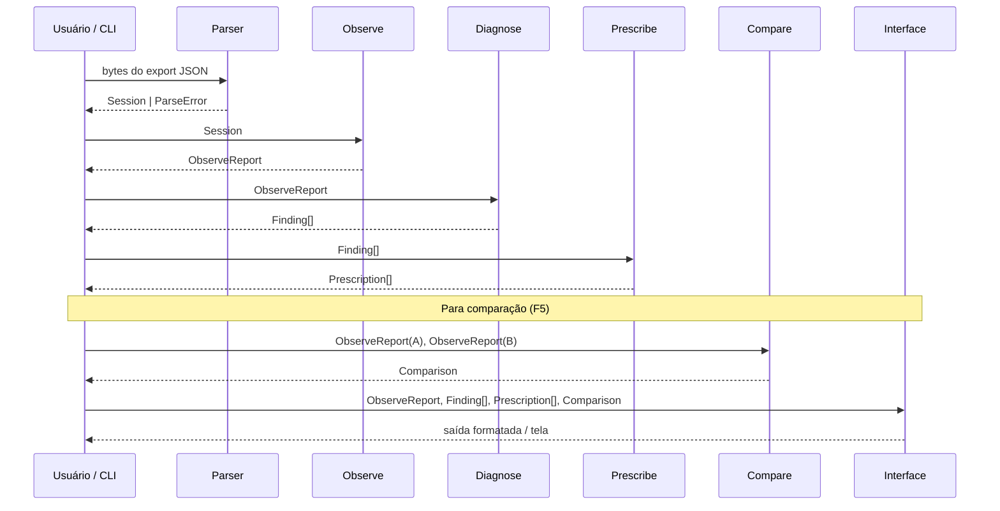

# Arquitetura — Hindsight

Documento de referência para implementação. Define componentes, fronteiras,
fluxo de dados, dependências permitidas, política de erros e rastreabilidade.
Uma pessoa nova deve conseguir identificar onde implementar cada fase do
roadmap sem reler este documento mais de uma vez.

---

## Visão geral

Hindsight é uma **ferramenta local de análise de sessões do IBM Bob**. Ela
recebe um export JSON de sessão, detecta padrões de desperdício, gera uma
configuração corrigida e compara duas rodadas do mesmo experimento.

Não há backend, não há banco de dados, não há chamada a serviços externos no
caminho crítico. Toda a computação roda no processo local.

```text
export JSON (entrada não-confiável)
    │
    ▼
┌─────────────────────────────────────────────────────────┐
│  Parser          valida e normaliza o export bruto       │
│  (src/parser/)                                           │
└────────────────────────┬────────────────────────────────┘
                         │ Session (tipo normalizado)
                         ▼
┌─────────────────────────────────────────────────────────┐
│  Domínio / Observe   extrai métricas estáveis            │
│  (src/observe/)                                          │
└────────────────────────┬────────────────────────────────┘
                         │ ObserveReport
                         ▼
┌─────────────────────────────────────────────────────────┐
│  Detectores / Diagnose   identifica achados              │
│  (src/diagnose/)                                         │
└────────────────────────┬────────────────────────────────┘
                         │ Finding[]
                         ▼
┌─────────────────────────────────────────────────────────┐
│  Prescribe   gera artefatos de configuração              │
│  (src/prescribe/)                                        │
└────────────────────────┬────────────────────────────────┘
                         │ Prescription[]
                         ▼
┌─────────────────────────────────────────────────────────┐
│  Compare / Verify   delta entre rodadas                  │
│  (src/compare/)                                          │
└────────────────────────┬────────────────────────────────┘
                         │ Comparison
                         ▼
┌─────────────────────────────────────────────────────────┐
│  Interface / CLI / Demo   apresenta resultados           │
│  (src/cli/ ou src/ui/)                                   │
└─────────────────────────────────────────────────────────┘
```

---

## Componentes e responsabilidades

### `src/parser/`

**Responsabilidade:** receber bytes do export e devolver um `Session` válido ou
um `ParseError` descritivo.

- Lê `version`, `exportedAt`, `workspace` e `tasks[]`.
- Ignora chaves de raiz prefixadas por `_` (e.g., `_metadata`).
- Valida tipos obrigatórios com a biblioteca de validação do projeto.
- Rejeita o arquivo com erro compreensível se a estrutura for inválida.
- Trata o JSON como entrada não-confiável: não executa, não avalia.
- Não aplica lógica de negócio. Não calcula percentuais. Não classifica achados.

**Não importa nada de:** `observe`, `diagnose`, `prescribe`, `compare`, UI.

### `src/observe/`

**Responsabilidade:** transformar um `Session` em métricas estáveis e
tipadas que os detectores possam consumir.

- Ordena mensagens por `data._meta.timestamp` (não por `createdAt`).
- Extrai `TurnMetrics` de cada mensagem `assistant` com `_meta.spend`.
- Extrai `ToolCallRecord[]` achatados preservando o turno de origem e a
  correlação chamada ↔ resultado pelo `id`.
- Extrai `ContextBreakdown` calculando percentuais sobre `breakdown.total`.
- Calcula `conversationTokens = reportedTotal − total`.
- Conta turnos, tool calls, erros e intervenções humanas (`role: user` após
  a primeira mensagem).
- Produz `ObserveReport` — representação completa do que aconteceu na sessão,
  sem diagnóstico embutido.

**Não importa nada de:** `diagnose`, `prescribe`, `compare`, UI.

### `src/diagnose/`

**Responsabilidade:** converter sinais do `ObserveReport` em `Finding[]`
explicáveis, sem falsos positivos no baseline real.

- Cada detector é uma função pura: `(ObserveReport) => Finding[]`.
- Detectores P0 do roadmap:
  - `#13` — `projectRules === 0`
  - `#14` — ferramenta disponível e nunca chamada
  - `#12` — intervenção humana
- Detectores P1:
  - `#10` — releitura redundante (mesmo `path` em turnos distintos)
  - `#11` — retry após falha (`isError: true` seguido da mesma ferramenta)
- Cada `Finding` carrega a evidência redigível que o originou (ver
  [Rastreabilidade](#rastreabilidade)).

**Não importa nada de:** `prescribe`, `compare`, UI.

### `src/prescribe/`

**Responsabilidade:** transformar `Finding[]` em `Prescription[]` e gerar
artefatos de configuração revisáveis.

- Cada prescrição aponta para o(s) achado(s) que a motivaram.
- O gerador de `AGENTS.md` é determinístico: mesma entrada, mesmo arquivo.
- Não copia conteúdo privado de mensagens para o artefato gerado.
- Não inclui transcript bruto, segredos nem a solução completa do benchmark.
- Apresenta diff antes de gravar qualquer arquivo em disco.

**Não importa nada de:** `compare`, UI.

### `src/compare/`

**Responsabilidade:** receber dois `ObserveReport` (Rodada A e Rodada B) e
produzir um `Comparison` com deltas absolutos e percentuais.

- Registra também regressões e métricas sem mudança.
- Não escolhe qual métrica destacar — isso é responsabilidade da interface.

**Não importa nada de:** `diagnose`, `prescribe`, UI.

### `src/cli/` ou `src/ui/`

**Responsabilidade:** orquestrar os módulos acima e apresentar resultados ao
usuário.

- Único lugar onde é permitido chamar os outros módulos em sequência.
- Formata, trunca e redige dados sensíveis antes de exibir.
- O modo demo não depende de IBM Cloud, API key nem sessão ativa.
- Estados de carregamento, erro e ausência de Rodada B são apresentados com
  mensagem compreensível.

---

## Diagrama de dependências permitidas

Regra: **dependências só apontam para baixo** (em direção ao domínio). Nenhum
módulo de infraestrutura/UI importa domínio para tomar decisões de negócio.



**Regra explícita de proibição:**
- `parser` não importa `observe`, `diagnose`, `prescribe`, `compare` nem UI.
- `observe` não importa `diagnose`, `prescribe`, `compare` nem UI.
- `diagnose` não importa `prescribe`, `compare` nem UI.
- `prescribe` não importa `compare` nem UI.
- Nenhum módulo de domínio importa biblioteca de UI ou de CLI.

---

## Fluxo de dados detalhado



Cada etapa é invocável de forma independente. O CLI pode parar em qualquer
fase e emitir o resultado parcial.

---

## Fronteiras entre sinal, achado e prescrição

| Conceito | Tipo | Origem | O que contém |
|---|---|---|---|
| **Sinal** | campo do export | `parser` / `observe` | Dado bruto normalizado — sem interpretação |
| **Achado** (`Finding`) | tipo de domínio | `diagnose` | Interpretação de um sinal: severidade, confiança, evidência, rastreabilidade |
| **Prescrição** (`Prescription`) | tipo de domínio | `prescribe` | Ação corretiva derivada de um ou mais achados |

Um sinal nunca é elevado a achado sem passar por um detector explícito. Um
achado nunca é elevado a prescrição sem uma regra de mapeamento explícita em
`prescribe`. A interface só exibe; nunca infere.

### Contrato mínimo de um `Finding`

```
Finding {
  code:        string        // estável entre versões, e.g. "PROJ_RULES_ZERO"
  title:       string        // frase curta para exibição
  severity:    "high" | "medium" | "low"
  confidence:  "confirmed" | "likely" | "possible"
  taskId:      string        // task de origem
  turnIndices: number[]      // turnos envolvidos (0-based sobre assistants)
  evidence:    Evidence      // veja Rastreabilidade abaixo
  metric:      object        // o número observado
  explanation: string        // por que isso é um problema
  prescriptionHint: string   // tipo de prescrição possível
}
```

---

## Rastreabilidade

Todo achado deve ser rastreável até a origem exata no export. O campo
`evidence` do `Finding` carrega:

| Campo | O que identifica |
|---|---|
| `taskId` | Task de origem (`tasks[].task.id`) |
| `messageId` | Mensagem de origem (`messages[].id`) |
| `turnIndex` | Índice do turno do assistente (0-based) |
| `toolCallId` | `toolCalls[].id` ou `toolUsage.signature.id`, quando aplicável |
| `fieldPath` | Caminho JSON de origem, e.g. `"tasks[0].task.costs.contextWindowBreakdown.breakdown.projectRules"` |
| `redactable` | `true` se o campo contém conteúdo de mensagem ou argumento de ferramenta |

Achados cujo `redactable` é `true` devem ter o conteúdo substituído por
`[REDACTED]` quando a interface estiver no modo de redação.

---

## Política de erros e validação

### Entrada

- O export JSON é tratado como entrada não-confiável.
- Erros de parse produzem `ParseError { message, path?, received? }` — nunca
  exceção não-tratada que vaze stack trace para o usuário.
- Campos ausentes ou nulos em posições opcionais são tratados como
  indisponíveis (`null` / `undefined`), não como erro.
- O relatório marca métricas indisponíveis explicitamente em vez de inventar
  valores (e.g., tokens de entrada/saída não estão no export; o campo fica
  `null`, não `0`).

### Cálculos

- Valores monetários (`cost`) são preservados como `number` sem arredondamento
  durante os cálculos. Apresentação pode arredondar; domínio não.
- Timestamps são sempre epoch em milissegundos. Nenhum módulo de domínio
  converte para string ou Date antes do momento de apresentação.
- Percentuais do breakdown são calculados sobre `breakdown.total` (overhead
  fixo), não sobre `reportedTotal` (contexto total).

### Classificação de severidade dos erros ao usuário

| Situação | Comportamento |
|---|---|
| JSON inválido ou `version` ausente | Aborta com `ParseError` descritivo |
| Campo opcional ausente | Continua; marca como indisponível |
| Task sem mensagens | Inclui na sessão com aviso, não aborta |
| Detector lança exceção | Isola o detector; reporta como falha de detector, não como crash |
| Arquivo de saída já existe | Exibe diff; aguarda confirmação antes de sobrescrever |

---

## Dados sensíveis e redação

- Argumentos de ferramentas de arquivo (`path`, `content`) e conteúdo de
  mensagens do usuário são considerados potencialmente sensíveis.
- Nenhum módulo de domínio (parser, observe, diagnose) redige ou filtra dados
  — eles trabalham com os dados completos internamente.
- A redação acontece **somente na camada de saída** (interface / CLI).
- A flag `evidence.redactable` sinaliza quais campos de evidência devem ser
  reduzidos na exibição padrão.
- Fixtures sintéticas não devem conter caminhos reais, nomes de usuário nem
  conteúdo de repositório privado.
- O artefato gerado pela `prescribe` (e.g., `AGENTS.md`) não copia mensagens
  brutas, segredos nem a solução completa do benchmark.

---

## Modelo de tipos de domínio (resumo)

Tipos completos em `docs/domain-model.md`. Resumo das fronteiras:

```
Session          ← saída do parser; entrada de observe e compare
ObserveReport    ← saída de observe; entrada de diagnose e compare
Finding[]        ← saída de diagnose; entrada de prescribe
Prescription[]   ← saída de prescribe; entrada da interface
Comparison       ← saída de compare; entrada da interface
```

Tipos que cruzam fronteiras são imutáveis após sua criação. Nenhum módulo
downstream altera o objeto recebido.

---

## Onde implementar cada fase do roadmap

| Fase | Diretório principal | Tipos consumidos | Tipos produzidos |
|---|---|---|---|
| **F2 — Observe** (`#5`–`#9`) | `src/parser/`, `src/observe/` | bytes → `Session` → `ObserveReport` | `ObserveReport` |
| **F3 — Diagnose** (`#10`–`#14`) | `src/diagnose/` | `ObserveReport` | `Finding[]` |
| **F4 — Prescribe** (`#16`–`#18`) | `src/prescribe/` | `Finding[]` | `Prescription[]`, `AGENTS.md` |
| **F5 — Verify** (`#19`–`#20`) | `src/compare/` | `ObserveReport` × 2 | `Comparison` |
| **F6 — Interface** (`#21`–`#24`) | `src/cli/` ou `src/ui/` | todos os anteriores | saída formatada |

Cada módulo tem seus próprios testes unitários em `src/<modulo>/__tests__/` ou
`src/<modulo>/` com sufixo `.test.*`. Fixtures em `fixtures/` são
compartilhadas entre todos os módulos.

---

## Fixtures e modo demo

- `fixtures/sample-export.json` é cópia fiel do `benchmark/rodada-a.json` e
  serve como input padrão para testes e demo.
- Fixtures sintéticas cobrem casos que não aparecem no baseline real (export
  inválido, task sem mensagens, ferramenta com erro, resultado órfão, etc.).
- O modo demo carrega fixtures embutidas e não requer arquivo externo,
  credencial ou sessão ativa.

---

## Armadilhas confirmadas do schema

Estas armadilhas devem ser tratadas explicitamente no parser e nos testes:

- `messages[].createdAt` é o mesmo em todas as mensagens — inútil para
  ordenação. Usar `data._meta.timestamp`.
- `_meta.spend` só existe em mensagens `assistant`. Acessar sem guarda quebra.
- Um turno `assistant` pode conter múltiplos `toolCalls` em paralelo.
  Correlacionar pelo `id`, nunca pela ordem.
- `tasks[].task.status` fica `"active"` mesmo em task concluída. Usar
  `stop: true` na última mensagem `assistant`.
- `breakdown.total` ≠ `breakdown.reportedTotal`. A diferença é esperada.
- `tasks[].task.parentId` não-nulo indica subtask — não somar suas métricas
  duas vezes ao agregar a sessão.
- `gitSha` e `gitBranch` vêm `null`. O commit de partida é registrado
  manualmente.
